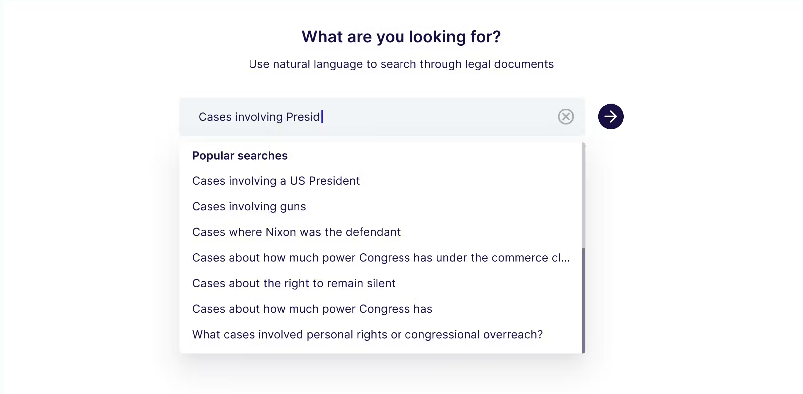
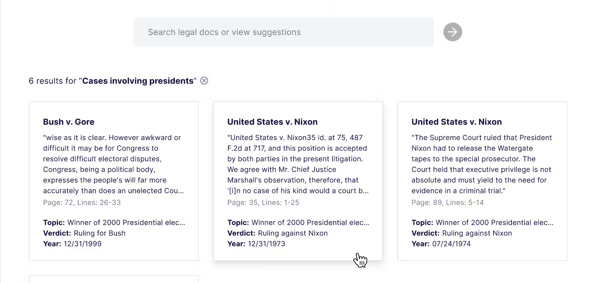

# Legal semantic search 

### Self-bootstrapping legal case semantic search sample app



Use natural language to search over legal cases stored in PDFs using Pinecone, LangChain and Voyage's domain-specific embeddings model. 



This app demonstrates how to programmatically bootstrap a custom knowledge base based on a Pinecone vector database with arbitrary PDF files included in the codebase.

The sample app use case is focused on semantic search over legal documents, but this exact same technique and code can be applied to any content stored locally.

### Built With

- Pinecone Serverless
- Voyage Embeddings
- Langchain
- Next.js + tailwind
- Node version 20 or higher

---

## Running the Sample App

### Want to move fast?

Use `npx create-pinecone-app` to adopt this project quickly.

### Create a Pinecone API key 

**Grab an API key here**

<div id="pinecone-connect-widget"></div>

This application will detect if you already have an index of the same name as the value 
you set in your `PINECONE_INDEX` environment variable. 

If you don't already have an index, the application will create one for you with the correct dimenions.

### Create a Voyage embeddings API key

Create a new account [here](https://www.voyageai.com/). 

Log into [the Voyage AI dashboard](https://dash.voyageai.com/) and create a new API key [here].

### Start the project

**Requires Node version 20+**

#### Dependency installation 

From the project root directory, run the following command.

```bash
cd legal-semantic-search && npm install --force
```

Make sure you have populated the client `.env` with relevant keys.

```bash
# You must first activate a Billing Account here: https://www.voyageai.com/ 
# Then get your Voyage API Key here: https://dash.voyageai.com/
VOYAGE_API_KEY="your-api-key-here"

# Get your Pinecone API key here: https://app.pinecone.io/
PINECONE_API_KEY="your-api-key-here"
PINECONE_INDEX="legal_semantic_search" # Or any other name you wish
```

Start the app.

```bash
npm run dev
```

## Project structure

In this example we opted to use a standard Next.js application structure. 

**Frontend Client**

The frontend uses Next.js, tailwind and custom React components to power the search experience. It also leverages API routes to make calls to the server to initiate bootstrapping of the Pinecone vector database as a knowledge store, and to fetch relevant document chunks for the UI.

**Backend Server**

This project uses Next.js API routes to handle file chunking, upsertion, and context provision etc. Learn more about the implementation details below.

### Simple semantic search 

This project uses a basic semantic search architecture that achieves low latency natural language search across all embedded documents. When the app is loaded, it performs background checks to determine if the Pinecone vector database needs to be created and populated.

**Componentized suggested search interface**

To make it easier for you to clone this app as a starting point and quickly adopt it to your own purposes, we've 
built the search interface as a component that accepts a list of suggested searches and renders them as a dropdown, helping the 
user find things: 

You can define your suggested searches in your parent component: 

```typescript
// For the purposes of our legal semantic search example, we pre-define some queries 
// that we know will pull back interesting results for the user
const suggestedSearches = [
  'Cases about personal freedoms being violated',
  'Cases involving a US President',
  'Cases involving guns',
  'Cases where Nixon was the defendant',
  'How much power does the commerce clause give Congress?',
  'Cases about personal rights or congressional overreach?',
  'Cases involving the ability to pay for an attorney',
  ...
];

// Then, we pass them into our SearchForm component: 
<SearchForm
  suggestedSearches={suggestedSearches}
  onSearch={(query: string) => {
    handleSearch(query, setResults, setIsSearching);
    setQuery(query);
  }}
/>

```

This means you can pass in any suggested searches you wish given your specific use case.

The SearchForm component is exported from `src/components/SearchForm.tsx`. It handles: 
 
* Displaying suggested searches
* Allowing the user to search, or clear the input
* Providing visual feedback to the user that the search is in progress

**Local document processing via a bootstrapping service**

We store several landmark legal cases as PDFs in the codebase, so that developers cloning and running the app locally can immediately build off the same experience being demonstrated by the legal semantic search app running on our Docs site. 

We use Langchain to parse the PDFs, convert them into chunks, and embed them. We store the resulting vectors in the Pinecone vector database.

**Knowledge base bootstrapping**

This project demonstrates how to programmatically bootstrap a knowledge base backed by a Pinecone vector database using arbitrary PDF files 
that are included in the codebase.

The sample app use case is focused on semantic search over legal documents, but this exact same technique and code can be applied to any content stored locally.

```typescript
export const handleBootstrapping = async (targetIndex: string) => {

  try {
    console.log(`Running bootstrapping procedure against Pinecone index: ${targetIndex}`);

    // If a Pinecone index with the target name doesn't exist, create it
    // If it does exist, return while suppressing conflict errors
    await createIndexIfNecessary(targetIndex);

    // Short-circuit early if the index already exists and has vectors in it 
    const hasVectors = await pineconeIndexHasVectors(targetIndex);
    if (hasVectors) {
      console.log('Pinecone index already exists and has vectors in it - returning early without bootstrapping');
      return NextResponse.json({ sucess: true }, { status: 200 });
    }

    if (!hasVectors) {
      console.log('Pinecone index does not exist or has no vectors in it - bootstrapping');
    }

    // Load metadata from db.json
    const metadata = await readMetadata();

    // Form the local path to the PDFs documents
    const docsPath = path.resolve(process.cwd(), 'docs/')

    const loader = new DirectoryLoader(docsPath, {
      '.pdf': (filePath: string) => new PDFLoader(filePath),
    });

    // Load all PDFs within the specified directory
    const documents = await loader.load();

    // Merge extracted metadata with documents based on filename
    documents.forEach((doc, index) => {
      const fileMetadata = metadata.find(meta => meta.filename === path.basename(doc.metadata.source));
      if (fileMetadata) {
        doc.metadata = { ...doc.metadata, ...fileMetadata, pageContent: doc.pageContent };
      } else {
        console.warn(`No metadata found for ${doc.metadata.source}`);
      }
    });

    // Split text into chunks
    const splitter = new RecursiveCharacterTextSplitter({ chunkSize: 1000 });
    const splits = await splitter.splitDocuments(documents);

    // Assign unique IDs to each split and flatten metadata
    const castedSplits: Document[] = splits.map(split => ({
      pageContent: split.pageContent,
      metadata: {
        ...flattenMetadata(split.metadata as Document['metadata']),
        id: uuidv4(),
        pageContent: split.pageContent, // Ensure pageContent is included in metadata
      },
    }));

    // Extract page contents
    const pageContents = castedSplits.map(split => split.pageContent);

    // Generate embeddings for each chunk
    const voyageEmbeddings = new VoyageEmbeddings({
      apiKey: process.env.VOYAGE_API_KEY,
      inputType: "document",
      modelName: "voyage-law-2",
    });

    const embeddings = await voyageEmbeddings.embedDocuments(pageContents);

    // Combine embeddings with metadata and ensure IDs are defined
    const vectors = castedSplits.map((split, index) => {
      if (!split.metadata.id) {
        throw new Error('Document chunk is missing an ID');
      }
      return {
        id: split.metadata.id!,
        values: embeddings[index],
        metadata: split.metadata,
      };
    });

    const pc = new Pinecone();
    const index = pc.Index(process.env.PINECONE_INDEX as string);

    // Batch upserts to stay within the 2MB request size limit
    await batchUpserts(index, vectors);

    console.log('Bootstrap procedure completed.');
    return NextResponse.json({ success: true }, { status: 200 });

  } catch (error) {
    console.error('Error during bootstrap procedure:', error);
  }

  return true;
}
```
When a user access the app, it runs a check to determine if the bootsrapping procedure needs to be run.

If the Pinecone index does not already exist, or if it exists but does not yet contain vectors, the bootstrapping procedure is run. 

The bootsrapping procedure: 
* Creates the Pinecone index specified by the `PINECONE_INDEX` environment variable
* Loads metadata from the `docs/db.json` file
* Loads all PDFs in the `docs` directory
* Merges extracted metadata with documents based on filename
* Splits text into chunks
* Assigns unique IDs to each split and flattens metadata
* Upserts each chunk to the Pinecone vector database, in batches

**Domain-specific embeddings model**

This app uses Voyage AI's embeddings model, `voyage-law-2`, which is purpose-built for use with legal text. This app includes a small handfull of landmark U.S. cases from Justia.

During the bootstrapping phase, the case documents are chunked and passed to Voyage's embeddings model for embedding: 

```typescript
// Generate embeddings for each chunk
const voyageEmbeddings = new VoyageEmbeddings({
  apiKey: process.env.VOYAGE_API_KEY,
  inputType: "document",
  modelName: "voyage-law-2",
});
```

When the user executes a search, their query is sent to the `/api/search` route, which also uses 
Voyage's embeddings model to convert the user's query into query vectors: 

```typescript

// Initialize VoyageEmbeddings
const voyageEmbeddings = new VoyageEmbeddings({
  apiKey: process.env.VOYAGE_API_KEY,
  inputType: 'document',
  modelName: "voyage-law-2",
});

// Initialize PineconeVectorStore
const vectorStore = new PineconeStore(voyageEmbeddings, {
  pineconeIndex: pc.Index(process.env.PINECONE_INDEX as string),
});

const retrieved = await vectorStore.maxMarginalRelevanceSearch(query, { k: 20 });
```
---

## Troubleshooting

Experiencing any issues with the sample app?
[Submit an issue, create a PR](https://github.com/pinecone-io/sample-apps/), or post in our [community forum](https://community.pinecone.io)!

